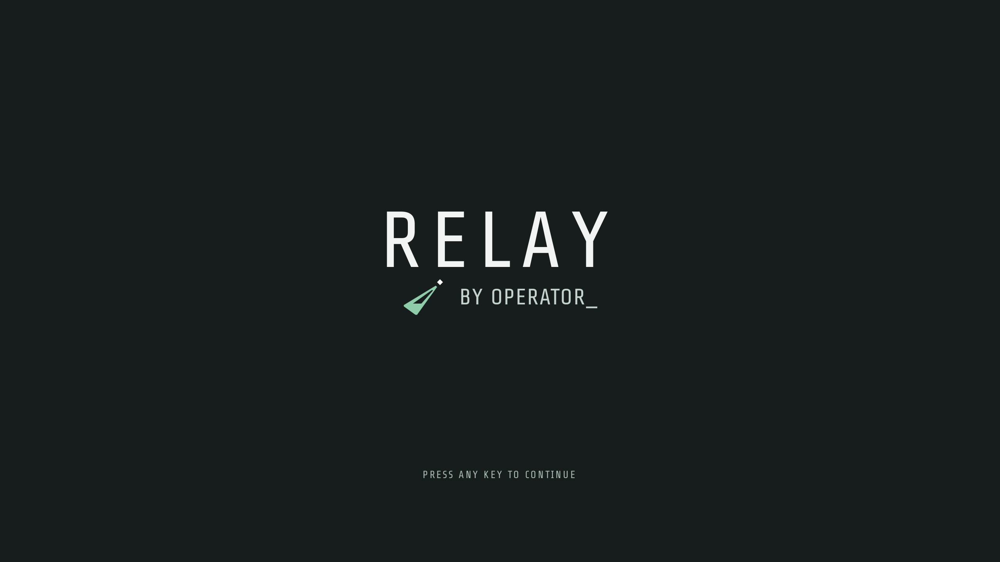
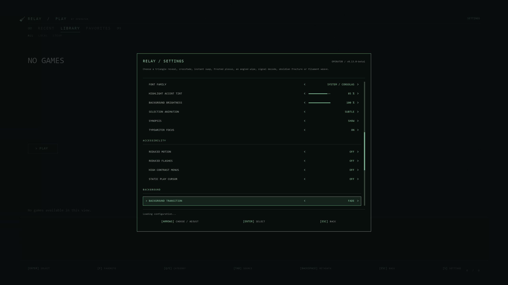
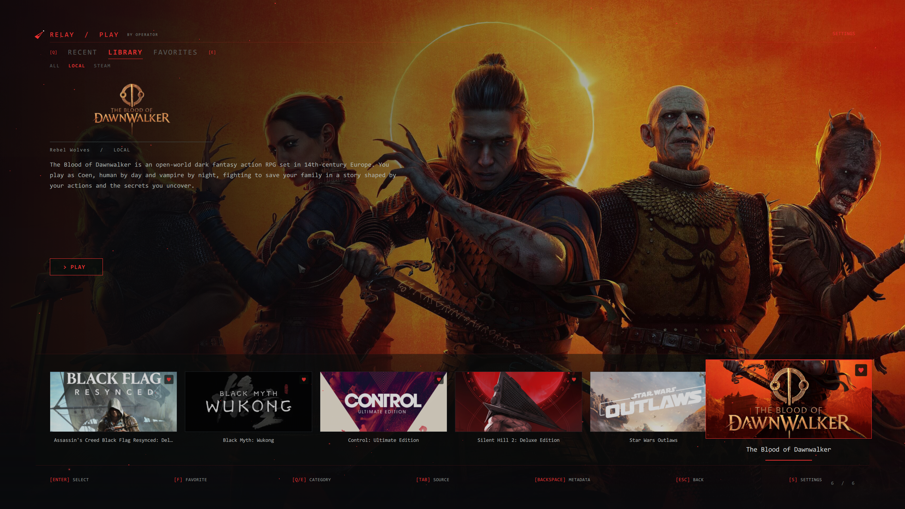

# Relay by Operator

A cinematic Pegasus theme for browsing and launching a game library with a controller or keyboard. Customize accents, typography, sounds, particles and background transitions; keep everyday controls simple and put detailed visual tuning in Advanced Settings.

**0.13.0-beta1 — Windows-first beta candidate.** Not yet submitted to the gallery. Physical-controller, game-launch/return and GPU performance sign-off remain outstanding. Linux, Android and macOS are not verified targets for this release.

These are actual Qt-rendered theme screens from an isolated test fixture, not a screenshot of a populated game library. No commercial game artwork is bundled.

## Install

1. Install Pegasus separately and configure a game library using its own documentation.
2. Extract the `RelayPegasus` folder into Pegasus's `themes` directory. `theme.qml` and `theme.cfg` must be directly inside `RelayPegasus`, not another nested copy.
3. In Pegasus Settings, choose **Relay** as the theme.

Typical Windows location: `%LOCALAPPDATA%/pegasus-frontend/themes/`. A portable installation uses `config/themes/` beside the Pegasus executable. [Official installation guide](https://pegasus-frontend.org/docs/user-guide/installing-themes/).

No Python, provider account or trailer file is needed to browse and launch a library that Pegasus already knows about. Relay uses the game's artwork and metadata supplied by Pegasus. It does not configure remote streaming, emulators or game launch commands for you.

## Controls

- Left/right: browse games. Up/down: switch between the rail and Play actions. Confirm a game, then activate Play to launch it.
- Q/E: Recent / Library / Favorites. Tab: All / Local / Steam. F: favorite. Backspace: Game Data. S: Settings; S again opens Advanced.
- Controller prompts follow the selected layout; configure the controller in Pegasus first. AUTO switches input category but does not promise automatic Xbox-versus-PlayStation identification.
- Escape/Back closes theme dialogs. Outside a theme dialog, Pegasus owns the global menu/back action.
- The splash continues automatically by default. Settings > Startup can disable it or make it wait. A key/button/click skips it on release; arrows, stick movement and mouse wheel do not dismiss it.

## Comfort and accessibility

Reduced Motion suppresses animated title entrances, parallax, typing, particles and card motion. Reduced Flashes suppresses the strongest procedural highlights and substitutes gentler transitions. High Contrast strengthens menu text and focus styling; it is not a guarantee of contrast over every game image. Text size, font, audio volume and a static Play cursor are configurable.

The installed Pegasus build used in testing rejects Qt accessibility attached objects. **Screen-reader support is not implemented.** Long synopses can still be truncated. Large-text layouts need a physical living-room/controller check before release sign-off. Accessibility choices are preserved by appearance reset.

Fresh installs use the lighter angled wipe, modest particles, sound off and automatic splash continuation. Heavy glass effects remain optional. Reduce particles/glow or use Fade if frame rate suffers. Trailers are absent until native streaming can be verified; there is no browser or local-video fallback.

## Optional artwork/metadata helper (Windows)

Only needed for Relay's Game Data search, artwork retrieval, metadata editing and JSON settings export. It is not needed for ordinary library browsing or Pegasus's saved theme preferences.

1. Install Python 3 and install Pillow: `py -3 -m pip install -r relay-metadata/requirements.txt`.
2. Copy `relay-config.example.json` to `relay-config.json` beside `theme.qml`. Enter your own IGDB client ID/secret and optionally a SteamGridDB key. Do not publish this file.
3. Run `relay-metadata/START_HELPER.bat`. It binds to `127.0.0.1:47831`.
4. After testing the helper, optionally enable **Auto-start Artwork Helper** in Settings. It is off by default. A manually running helper is detected even with auto-start off.

Game Data changes remain drafts until Apply. Backing out of a changed draft asks before discarding. Clearing asks before removing the selected game's Relay-generated metadata and downloaded artwork; it does not delete game executables or other providers' metadata.

The helper writes generated metadata/media beside the configured game metadata root. Back up your library metadata before experimenting. Auto-start and managed lifetime are Windows-specific; use of the optional helper on other platforms is unverified.

## Update or uninstall

Close Pegasus. Back up `relay-settings.json`, `relay-config.json` and any modified files before updating. Replace theme program files with the new release while keeping your personal files; releases deliberately do not contain them. Existing saved visual choices take precedence over new defaults.

To uninstall, select another theme first, then remove the Relay theme folder. Metadata/media previously generated alongside your game library are separate and are not removed by deleting the theme folder.

## Troubleshooting

- Theme failed to load: select another theme and inspect Pegasus's `lastrun.log`. Include the error lines, Pegasus version, OS, resolution and whether a controller was connected in a bug report.
- Empty library: verify games appear in another Pegasus theme, then check Relay's category/source filters.
- Helper offline: the normal library should still work. Start the helper manually to see Python/provider errors. Check credentials, Pillow and whether another service is using port 47831.
- Settings export pending: preferences remain in Pegasus; JSON export requires the helper.
- Wrong button prompts: choose Keyboard, Xbox or PlayStation explicitly in Settings.

## License

MIT for original code. See LICENSE and THIRD-PARTY-NOTICES.md for attribution and bundled asset notices.
